# KuriCon 使い方

KuriCon（くりこん）は、**格闘ゲームの操作を、少しだけ変えられる道具**です。

いつも使っているアーケードコントローラやゲームパッドはそのままに、次のことができるようになります。

- **声を出すと、ボタンが押される**
- **ボタンの反応を裏返す**（押していないときに押された状態になり、押すと離れる）

ゲーム側の設定は何も変えません。ゲームから見ると、いつもと同じコントローラが繋がっているように見えます。

---

## 1. どんなときに使うもの？

### 声でボタンを押す

指が足りないときに使えます。たとえば、両手がふさがっているのに、もうひとつボタンを押したい場面です。

「あっ」と声を出すと、決めておいたボタンが押されます。

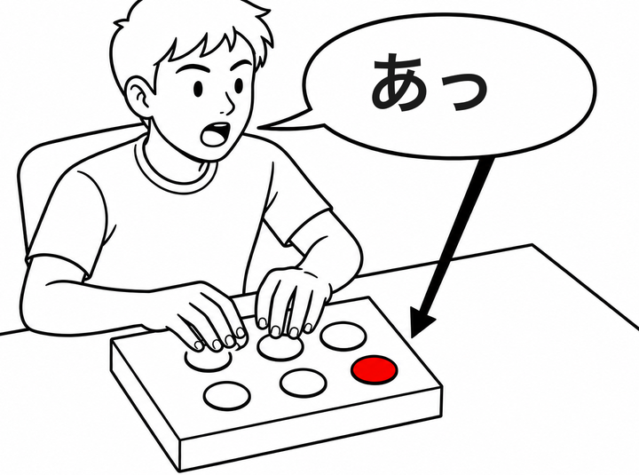

### ボタンの反応を裏返す

**押していないときに押された状態**になり、**押すと離れます**。ふつうとは逆です。

たとえば、ずっと押しっぱなしにしておきたいボタンがあるとき、これを使うと**指を離しているあいだ押されたまま**になります。

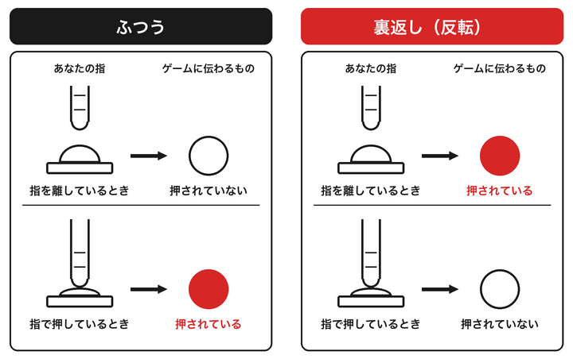

---

## 2. 使うために必要なもの

| 必要なもの | 説明 |
|---|---|
| Windows のパソコン | Windows 10 か Windows 11 |
| USB のコントローラ | いつも使っているもので大丈夫です |
| マイク | 声を使う場合だけ必要です。パソコンに付いているものでも、後から挿すものでも構いません |

**ノートパソコンの内蔵マイクは、うまく動かないことがあります。** 声を使いたいのに反応しないときは、イヤホンマイクなどを挿してみてください。

---

## 3. 入れ方

### 3-1. ファイルをダウンロードする

配布されているファイル（`KuriCon-Setup-0.4.1.exe` のような名前）をパソコンに保存します。

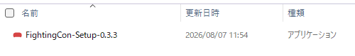

### 3-2. ファイルをダブルクリックする

「インストール」を押すと、始まります。

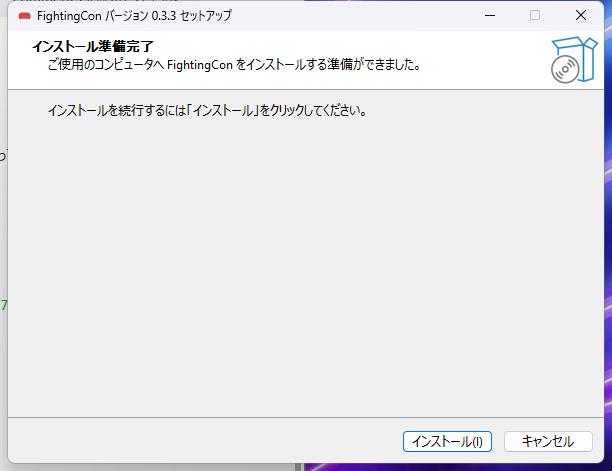

### 3-3. 途中で「はい」を押す

インストールの途中で、**「このアプリがデバイスに変更を加えることを許可しますか?」**という青い画面が出ます。**「はい」**を押してください。

<!-- 画像4：Windows の「ユーザーアカウント制御」の画面。この画面は他のアプリから撮影できない仕組みになっている。2026/8/7 に、図を描かず、上の文章だけで補うと決めた。 -->

> **なぜ聞かれるの？**
> このアプリは、コントローラを扱うための小さな部品をパソコンに追加します。そのため、Windows が「本当にいいですか」と確認しています。**この画面は、初めて入れるときだけ出ます。**

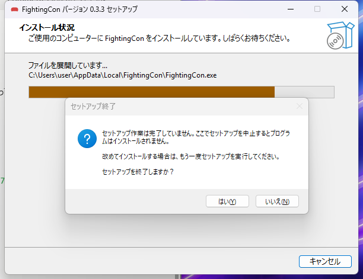

### 3-4. 最後の説明を読む

**使う前に守ってほしいことが3つ出ます。** ここに書いてあることは、この説明書の 3-5 と 4 に同じ内容があります。

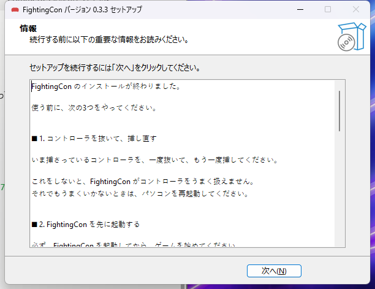

「完了」を押すと終わりです。

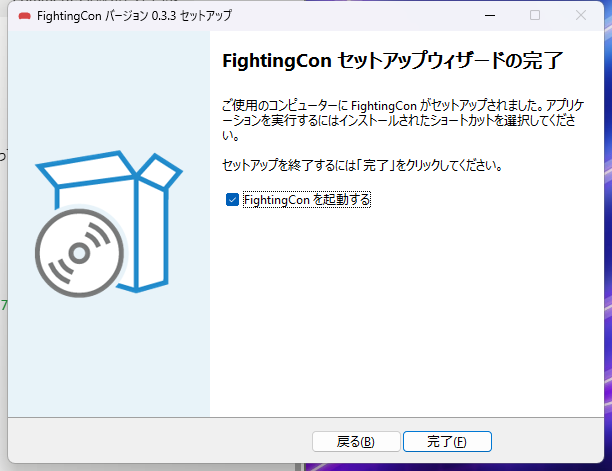

### 3-5. コントローラを挿し直す

**コントローラを一度抜いて、もう一度挿してください。**

これを忘れると、後の手順でつまずきます。

うまくいかないときは、パソコンを再起動してから、もう一度挿し直してください。

---

## 4. 使い方

### 4-1. KuriCon を起動する

スタートメニューを開いて「KuriCon」と打つと出てきます。

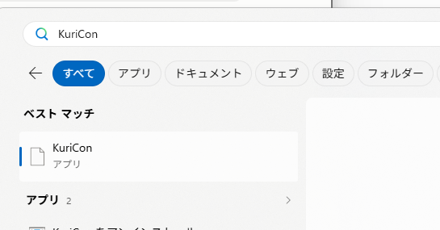

起動すると、**画面の右下**に小さなアイコンが出ます。

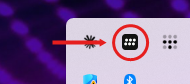

> **アイコンが見当たらないときは**
> 右下の小さな **∧**（上向きの矢印）を押すと、隠れているアイコンが出てきます。

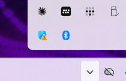

### 4-2. 使うコントローラを選ぶ

右下のアイコンを**右クリック**すると、メニューが出ます。

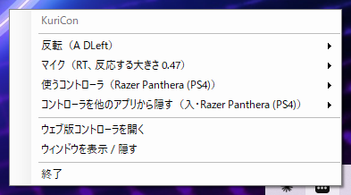

**「使うコントローラ」**から、自分のコントローラを選んでください。

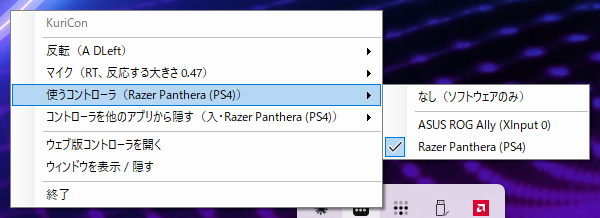

選んだコントローラは、**KuriCon だけが読むようになります。** 他のアプリからは見えなくなりますが、これは二重に押されるのを防ぐためで、故障ではありません（8 を見てください）。

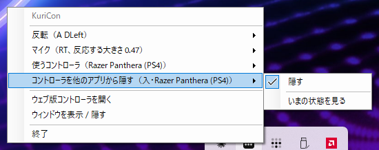

### 4-3. ゲームを始める

**ここが大事です。**

> ### 必ず、KuriCon を先に起動してから、ゲームを始めてください。

ゲームを先に開いてしまうと、うまく動きません。もし順番を間違えたら、**ゲームを一度閉じて、開き直して**ください。

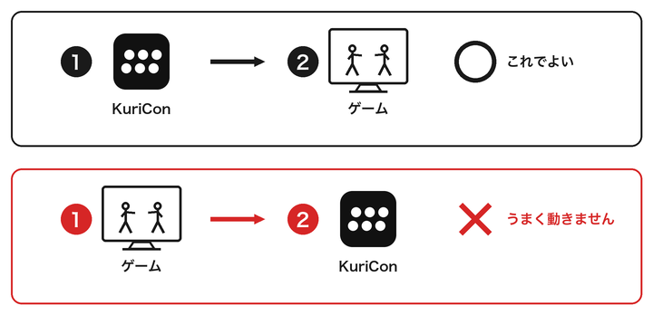

> ### Steam でゲームを買った人へ
>
> **Steam も一度閉じて、開き直してください。**
>
> Steam を立ち上げっぱなしにしている人は多いと思います。その状態だと、
> ゲームだけを開き直してもうまくいきません。**Steam ごと閉じて、開き直してください。**

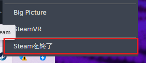

---

## 5. 声でボタンを押す

### 5-1. マイクを使えるようにする

右下のアイコンを右クリックし、**「マイク」**の中の**「有効にする」**を選びます。

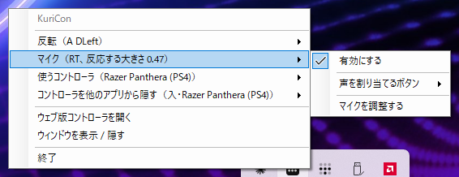

### 5-2. どのボタンを声で押すか決める

同じメニューの中から、**「声を割り当てるボタン」**を選びます。

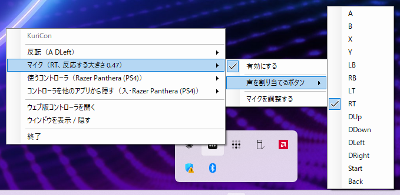

### 5-3. マイクを調整する

**部屋の音の大きさに合わせる作業**です。これをやらないと、声を出しても反応しなかったり、逆に何もしていないのに反応したりします。

メニューから**「マイクを調整する」**を選びます。

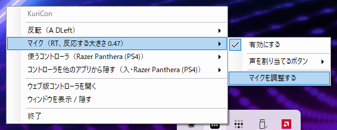

> **マイクは、口から少し離してください。**
>
> 口のすぐ前にあると、音が大きすぎて、うまく調整できません。
> 20センチくらい離すとちょうどよいです。

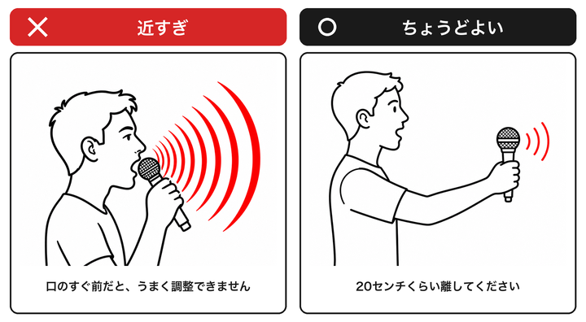

音が鳴って、次のように進みます。

| 音 | やること |
|---|---|
| **ピッ** と1回 | **5秒間、静かにしてください** |
| **ピッピッ** と2回 | **5秒間、声を出し続けてください**（「あー」でよい） |
| **低い音** | 終わりです |

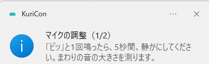

うまくいかなかったときは、その旨が表示されます。もう一度やってみてください。

> **声が拾えませんでした、と出たときは**
> マイクが繋がっていないかもしれません。パソコンの設定でマイクが使える状態か確かめてから、もう一度お試しください。

### 5-4. 使ってみる

声を出すと、決めたボタンが押されます。ゲームを始める前に、試してみてください。

---

## 6. ボタンの反応を裏返す

右下のアイコンを右クリックし、**「反転」**の中から、裏返したいボタンを選びます。

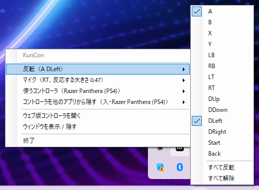

選んだボタンには**チェックの印**が付きます。もう一度選ぶと元に戻ります。

**いま何を裏返しているか**は、メニューを開かなくても分かります。下の例では、A と DLeft（十字の左）を裏返しています。

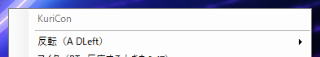

**全部まとめて裏返す・元に戻す**こともできます。

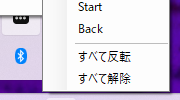

---

## 7. ゲームを小さい窓で遊んでいる人へ

ゲームを**画面いっぱいではなく、小さい窓**で遊んでいる場合、
KuriCon の設定を変えても、すぐには効いていないように見えます。

**設定を変えたら、ゲームの窓を一度クリックしてから**試してください。

これは、ゲームが「いま自分が使われている」ときだけコントローラを見ているためです。
故障ではありません。

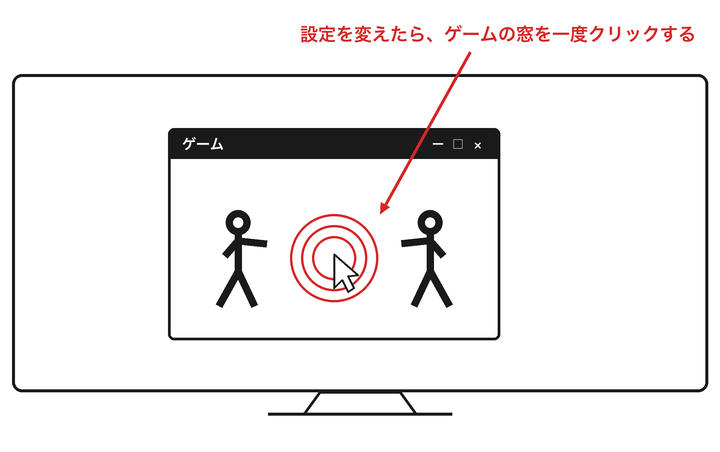

---

## 8. 困ったときは

### コントローラが動かない

**次の順に確かめてください。**

1. KuriCon が起動していますか（右下にアイコンがありますか）
2. コントローラを選びましたか（4-2 を見てください）
3. **ゲームより先に KuriCon を起動しましたか**（4-3 を見てください）
4. コントローラを挿し直しましたか（3-5 を見てください）

### 声を出しても反応しない

1. マイクを「有効」にしましたか（5-1）
2. **マイクの調整をしましたか**（5-3）。これを飛ばすと、たいてい反応しません
3. パソコンにマイクが繋がっていますか

内蔵マイクが使えない機種があります。イヤホンマイクなどを挿してみてください。

### どのゲームからもコントローラが見えなくなった

**KuriCon をもう一度起動してください。** それで直ります。

KuriCon は、動いているあいだ、**選んだコントローラを他のアプリから隠しています**。これは、元のボタンとの二重押しを防ぐためです。何かの拍子に KuriCon が終わってしまうと、隠したままになることがあります。

もう一度起動すれば、自動で元に戻します。

**隠すのをやめたいときは**、右下のアイコンを右クリックし、**「コントローラを他のアプリから隠す」**の中の**「隠す」**の印を外してください。

> **パソコンを切ったあとも、見えないままのことがあります**
>
> KuriCon を終了せずにパソコンを切ると、隠したままの状態が残ります。
> **KuriCon をもう一度起動すれば、その場で元に戻ります。**
>
> パソコンを切る前に KuriCon を終了しておけば、この状態にはなりません。

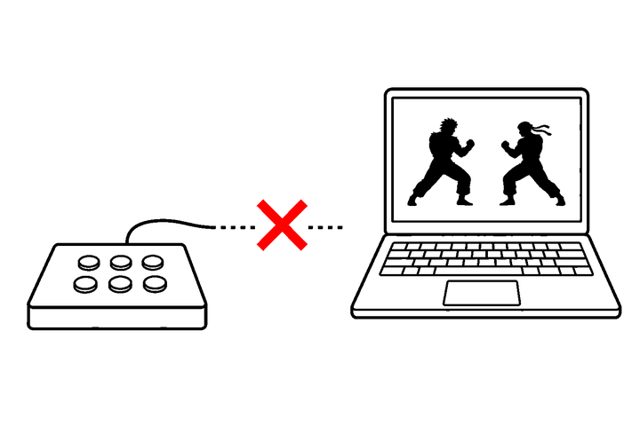

> **それでも戻らないときは**
> パソコンを再起動してから、KuriCon をもう一度起動してみてください。

<details>
<summary>それでも直らないときの、最後の手段</summary>

次のようにすると、隠す働きそのものを止められます。パソコンの設定は何も変わりません。

1. Windows キーを押して、`cmd` と打ち、出てきた「コマンド プロンプト」を選ぶ
2. 黒い画面に、次の1行をそのまま貼り付けて、Enter キーを押す

```
"C:\Program Files\Nefarius Software Solutions\HidHide\x64\HidHideCLI.exe" --cloak-off
```

3. 何も出なければ、それで終わりです。コントローラが見えるようになります

</details>

### 遊んでいる途中でコントローラを差し替えた

**次の順にやり直してください。**

1. 新しいコントローラを挿す
2. 右下のアイコンから「使うコントローラ」を開き、新しいほうを選ぶ
3. **ゲームを終了する**
4. **Steam を使っている場合は、Steam も終了して、起動し直す**
5. ゲームを起動する

差し替えた直後は、**新しいコントローラの入力がゲームへ直接も届いてしまいます。** ボタンが二重に押された状態になり、裏返しの設定も効かなくなります。

これは、ゲームや Steam が、コントローラを挿した瞬間に掴んでしまうためです。KuriCon が隠すより先に掴まれるので、あとから隠しても間に合いません。**ゲームと Steam を起動し直せば直ります。**

### 終わり方が分からない

右下のアイコンを右クリックし、**「終了」**を選んでください。

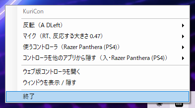

**窓の右上の × では終わりません。** 画面から消えるだけで、動き続けます。これは、ゲームをしているあいだ邪魔にならないようにするためです。

---

## 9. 消し方（アンインストール）

### 9-1. 先に KuriCon を終了する

**必ず、終了してから消してください。**

右下のアイコンを右クリックし、「終了」を選びます。

### 9-2. スタートメニューから消す

スタートメニューを開いて「KuriCon」と打つと、**「KuriCon をアンインストール」**が出てきます。これを選んでください。

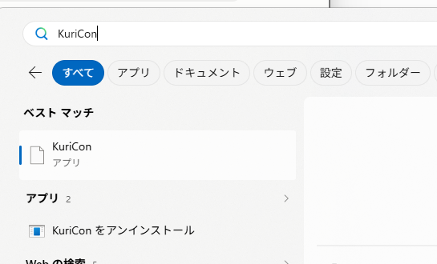

あとは画面の指示に従うだけです。

> **Windows の「設定」からは消せないことがあります**
> 「設定」→「アプリ」→「インストールされているアプリ」の一覧に、KuriCon が出てこない場合があります。
> そのときは、上のスタートメニューからの方法を使ってください。

### 9-3. 追加された部品について

KuriCon と一緒に入った部品は、消さずに残ります。他のソフトが使っていることがあるためです。**そのままにしておいて問題ありません。**

気になる場合は、同じ画面から次のものを探して削除できます。

- ViGEm Bus Driver
- HidHide

---

## 10. よくある質問

### ゲームの設定は変えなくていいの？

**変えなくて大丈夫です。** ゲームからは、いつもと同じコントローラが繋がっているように見えます。

### 遅くなったりしない？

ボタンを押してからゲームに届くまで、**1000分の1.5秒**ほど遅くなります。ゲームの1コマ（60分の1秒）よりずっと短いので、まず気づきません。

### コントローラを変えたいときは？

右下のアイコンを右クリックし、「使うコントローラ」から選び直してください。

### 設定は覚えてくれる？

マイクの調整の結果は覚えています。次に起動したときも、そのまま使えます。

反転の設定は、起動のたびに元に戻ります。

---

## 11. うまくいかないときの連絡先

<!-- ここに連絡先を書く。GitHub の Issue か、メールアドレスか -->

次のことを教えていただけると、原因が分かりやすくなります。

- 使っているコントローラの名前
- Windows のバージョン
- どこでつまずいたか（この説明書の番号で教えてください）
